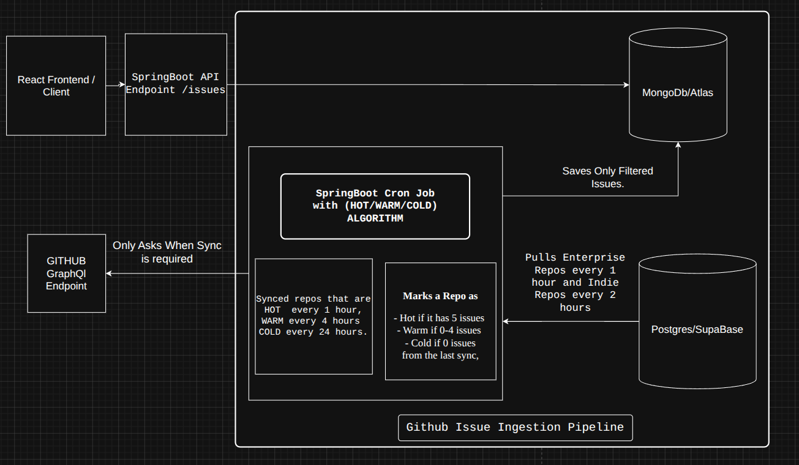
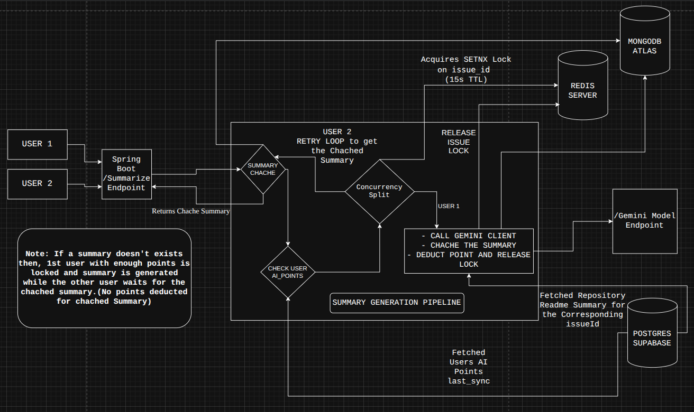
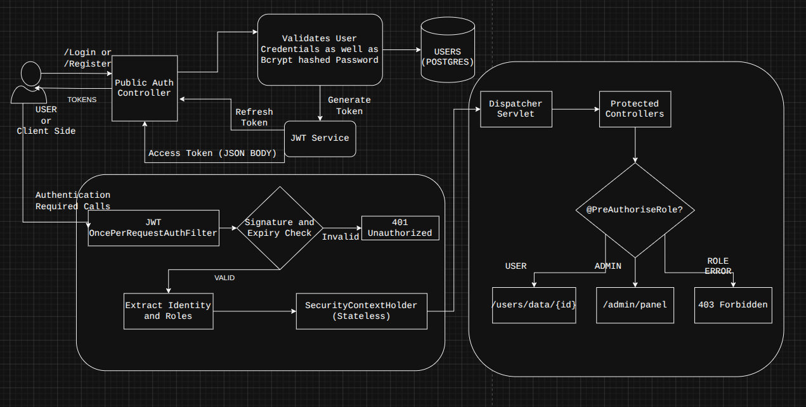

# 🚀 Too Many Issues - Core API & Ingestion Engine

> The enterprise-grade Spring Boot backend powering **[Too Many Issues](https://toomanyissues.vercel.app)**.
> Designed to ingest, index, and summarize real-time GitHub issues across the open-source ecosystem without hitting API rate limits.

[](https://java.com)
[](https://spring.io/projects/spring-boot)
[](https://postgresql.org)
[](https://mongodb.com)
[](https://redis.io)

## 📌 Overview
This repository contains the RESTful API and automated background workers for the Too Many Issues platform. Instead of simply wrapping the GitHub API, this system utilizes a custom scheduling algorithm, distributed caching, and a polyglot persistence layer to autonomously manage massive data ingestion and AI summarization at scale.

---

## 🏗️ System Architecture & Engineering Highlights

### 1. The Ingestion Engine (Dynamic Polling Algorithm)
To index thousands of repositories without exhausting GitHub's API rate limits, I engineered a custom **"Thermostat" (Hot/Warm/Cold) polling algorithm**.
* **Mechanism:** The cron-scraper dynamically adjusts its polling frequency based on repository activity. Repositories with high issue frequency are polled every hour, while inactive "Cold" repositories are throttled to a 24-hour sync.
* **Result:** Achieved a massive reduction in unnecessary API calls while maintaining real-time relevance for active open-source projects.



### 2. AI Summarization Pipeline & Distributed Concurrency
The platform integrates the **Gemini AI Model** to summarize complex issue threads. To prevent a "thundering herd" race condition (where multiple users request a summary for the same un-cached issue simultaneously), I implemented distributed locking.
* **Mechanism:** Utilizes Redis `SETNX` locks with a 15-second TTL. The first user acquires the lock and triggers the Gemini generation pipeline, while concurrent requests poll the cache.
* **Result:** Prevents duplicate API calls, saves AI token credits, and ensures data consistency across the cluster.



### 3. Polyglot Data Persistence
* **PostgreSQL (Supabase):** Enforces strict relational integrity for User accounts, Role-Based Access Control (RBAC), and user tracking (AI Point deductions).
* **MongoDB (Atlas):** Handles high-volume, schema-less data. Utilizes compound indexing to efficiently query and serve the massive payload of unstructured GitHub issue text and markdown.

### 4. Stateless Security & JWT Rotation
Implemented a deeply customized Spring Security filter chain ensuring robust, stateless authentication.
* **Access Tokens:** Short-lived JWTs returned via JSON payload for Authorization headers.
* **Refresh Tokens:** Long-lived tokens securely issued as `HttpOnly` cookies to mitigate XSS (Cross-Site Scripting) attacks.
* **RBAC:** Enforced via `@PreAuthorize` to strictly separate `USER` application logic from `ADMIN` metric dashboards.



---

## 💻 Tech Stack

* **Core:** Java 17, Spring Boot 3, Spring Data JPA, Spring Security
* **Databases:** PostgreSQL (Relational), MongoDB (Document)
* **Caching & Concurrency:** Redis
* **AI Integration:** Google Gemini API
* **Deployment:** AWS EC2, Docker Compose, Nginx (Reverse Proxy + Let's Encrypt SSL)

---

## 🚀 Local Setup & Installation

**Prerequisites:** Java 17, Maven, Docker (for Redis/DB instances)

**1. Clone the repository:**
```bash
git clone https://github.com/narayanpdas/toomanyissues-backend.git
cd toomanyissues-backend
```
**2. Configure Environment Variables:**
Create an application-dev.yml or .env file in the root directory and configure the following keys:

```aiignore

SPRING_DATASOURCE_URL=jdbc:postgresql://localhost:5432/toomanyissues
SPRING_DATASOURCE_USERNAME=your_pg_user
SPRING_DATASOURCE_PASSWORD=your_pg_pass

SPRING_DATA_MONGODB_URI=mongodb+srv://...

SPRING_REDIS_HOST=localhost
SPRING_REDIS_PORT=6379

app.JWTTokenTimeOut = Your access token length

app.refreshTokenTimeout = Your refresh token length

app.JWTSecretKey=your_secure_jwt_secret_key
GEMINI_API_KEY=your_gemini_api_key
app.githubPAT=your_github_personal_Access_token
app.cors.allowed-origins=localhost or your frontend
```

**2. Run the Application:**
```
mvn clean install
mvn spring-boot:run
```
The server will start on http://localhost:8080.

# 📬 Contact & Live Platform
Live: https://toomanyissues.vercel.app

Creator: Narayan

LinkedIn: [Narayan](https://www.linkedin.com/in/narayan-prasad-das-85257b249/)